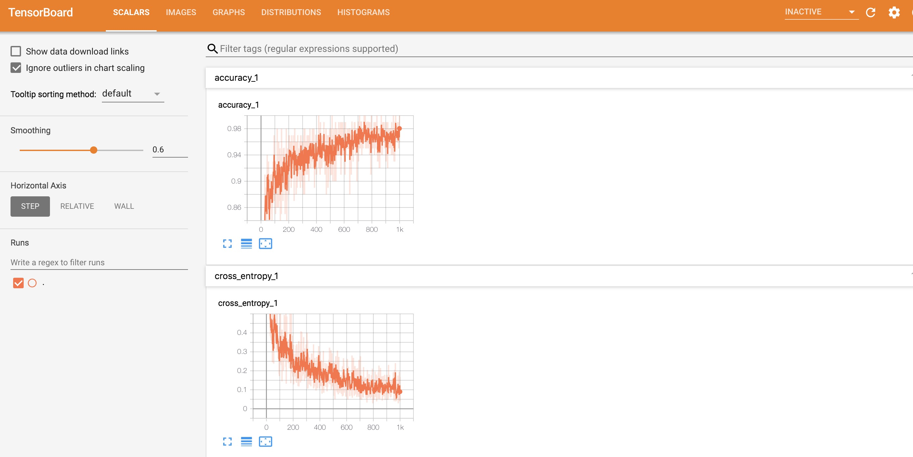
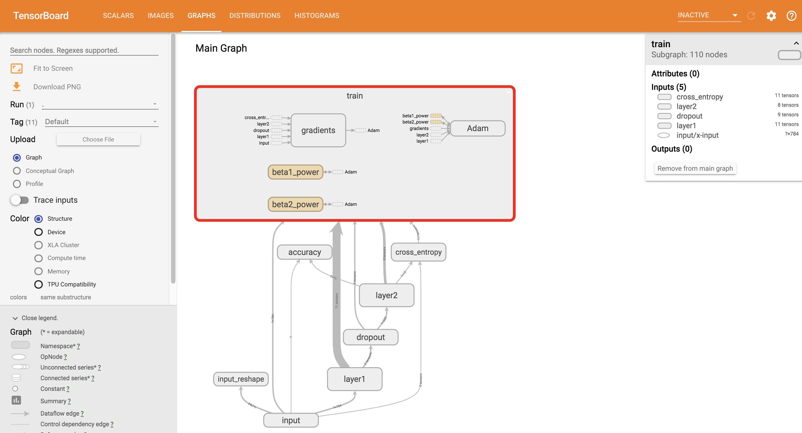
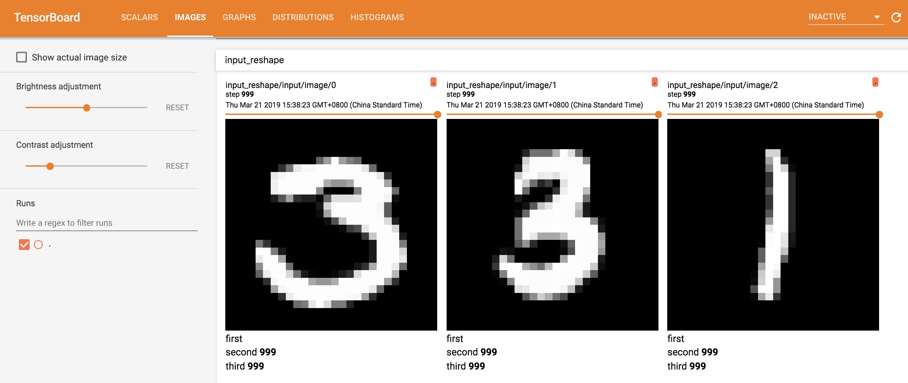

## MNIST: An hello-world example for Tensorflow with Tensorboard
Tensorboard 是一种可视化的工具，可以用来很好的辅助模型训练，提高模型训练的效率，熟练掌握Tensorboard工具对于从事Deep Learning开发很有必要。本文主要通过MNIST这个示例来说明使用编译产生的Tensorboard的过程。
### Overview
Deep Learning一般包括Train和Inference两个阶段：在Train的过程，根据输入数据和optimization方法，采用iterative method得到最后的模型参数；在Inference的过程，根据输入的数据，模型产生结果。然而模型train的过程，需要不断调整参数，比如learning rate、weight decay等，为了更好的查看当前模型的收敛情况，收集模型训练过程中产生的data信息，并可视化他们，可以很好的有利于模型训练。

在Deep Learning中，MNIST是一个包括60000张train图片和10000张test图片，图片大小为28\*28\*1,规模比较小，很适合作为Deep Learning领域的hello-world示例。
### Requirement for Installation
本文所有的运行环境在CentOS 7环境下，利用python虚拟环境和pip的python包管理，其他版本的Linux环境类似。
1. 安装python虚拟环境
* 安装python2虚拟环境 
``` Install python2 virtual environment 
sudo yum install python-virtualenv
```
* 安装python3和python3虚拟环境
``` Install python3 virtual environment
sudo yum install ius-release 
sudo yum install python36u-devel python36u-libs python36u-pip python36u-setuptools
```
2. 创建和启动虚拟环境
* python2
``` create and activate python virtual environment 
virtualenv tensorboard-dev   # 创建python2 虚拟环境
source tensorboard-dev/bin/activate    # 启动python2 虚拟环境
```
* python3
``` create and activate python virtual environment
python3.6 -m venv tensorboard-dev   # 创建 python3 虚拟环境 
source tensorboard-dev/bin/activate   # 启动 python3 虚拟环境
```
3. 安装 tensorflow
* tensorflow CPU版本
``` install tensorflow-cpu 
pip install tensorflow    # 安装最新版本的 tensorflow，如果要安装具体的版本，采用pip install tensorflow==1.13 这种方式
```
* tensorflow GPU版本
``` install tensorflow-gpu
pip install tensorflow-gpu  # 安装最新版本的tensorflow-gpu，如果要安装具体的版本，采用pip install tensorflow-gpu==1.13这种方式
```
4. 安装bazel
安装bazel是为了构建和编译TensorBoard，定制Tensorboard
* Download bazel 
```
wget -c https://github.com/bazelbuild/bazel/releases/download/0.24.1/bazel-0.24.1-installer-linux-x86_64.sh # 这里下载的是 0.24版本，如果需要其他版本，只需要换对应的版本即可
```
* Install bazel
``` install bazel
sh bazel-0.24.0-installer-linux-x86_64.sh --prefix=<dir>  # 具体环境需要执行dir路径, 并更新环境变量PATH，使之包含bazel
```
### Build && Run TensorBoard 
* 下载Tensorboard代码
``` Download Tensorboard 
git clone https://github.com/tensorflow/tensorboard
```
* 进入python虚拟环境
```
source tensorboard-dev/bin/active 
```
* 编译 TensorBoard 
``` compile Tensorboard
cd tensorboard && bazel build //tensorboard
```
* 运行 TensorBoard
``` run TensorBoard
bazel run tensorboard -- --logdir=/tmp/images_demo --host=0.0.0.0 --port=10050  # logdir、host、port等都可以配置
```
* 查看 TensorBoard 的帮助命令选项 
``` help tensorboard
bazel run tensorboard -- --help
```
### Run on TensorFlow with Tensorboard
* 下载mnist的example代码，mnist代码存在tensorflow代码库 
```
git clone https://github.com/tensorflow/tensorflow
```
* 进入 mnist示例程序目录
```
cd tensorflow/examples/tutorials/mnist
```
* 运行带有summary的mnist示例
```
python mnist_with_summaries.py --log_dir /tmp/mnist     # log_dir存储用于tensorboard解析文件目录路径
```
* 启动 TensorBoard 解析数据
```
cd <TensorBoard root dir> && bazel run tensorboard -- --logdir=/tmp/mnist --host=0.0.0.0 --port=10050 
```
* 运行mnist示例，产生的scalar数据，如下所示


* 运行mnist示例，生成的神经网络结构，如下所示


* 运行mnist示例，输入的数据，如下所示

