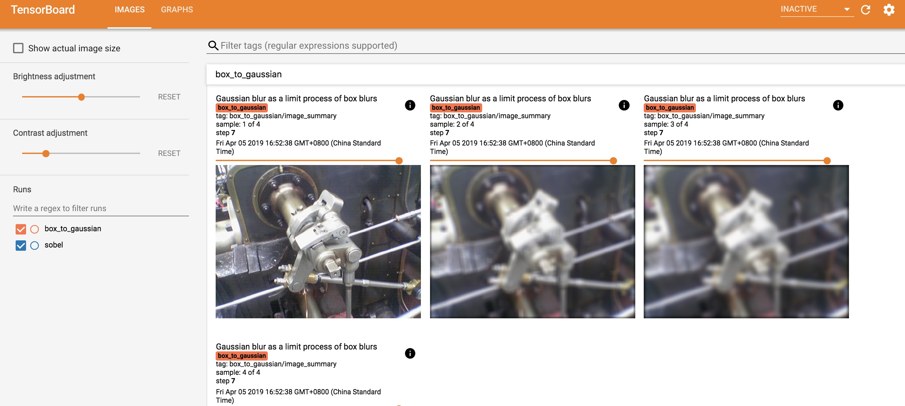

## The Build for TensorBoard
### Overview
TensorBoard 主要开发语言是 python和 javascript，并采用bazel构建 TensorBoard python package。本文主要是讲述从头开始构建TensorBoard python package，主要针对的是从事TensorBoard的开发人员，希望能够帮助他们快速的进入TensorBoard的开发状态。
### Build TensorBoard package 
* Requirements - download bazel
```sh
wget -c https://github.com/bazelbuild/bazel/releases/download/0.24.1/bazel-0.24.1-installer-linux-x86_64.sh # 这里下载的是 0.24版本，如果需要其他版本，只需要换对应的版本即可
```
* 创建 python 虚拟环境
  * python2
  
  ```
  virtualenv tensorboard-dev   # 创建python2 虚拟环境
  source tensorboard-dev/bin/activate    # 启动python2 虚拟环境
  ```
  * python3
  
  ```
  python3.6 -m venv tensorboard-dev   # 创建 python3 虚拟环境 
  source tensorboard-dev/bin/activate   # 启动 python3 虚拟环境
  ```
* build and install Tensorboad 
  * 以bazel方式运行
  ```sh
  bazel build //tensorboard
  bazel run tensorboard -- --logdir=<dir> --port=[port]      # 以bazel方式运行tensorboard
  ```
  * 以python库方式运行
  ```
  bazel run //tensorboard/pip_package:build_pip_package
  cd /tmp/tensorboard/dist
  pip install tensorboard-1.14.0a0-py3-none-any.whl        # 生成的python wheel放到/tmp/tensorboard目录下，这里假设是python3的wheel
  ```
### Test plugins of TensorBoard 
TensorBoard的代码库除了整体的运行测试以外，还可以单独测试每个plugin的数据
1. Image Plugin
* 运行如下代码，生成image插件可以识别的数据
```sh
bazel run //tensorboard/plugins/image:images_demo
```
* 运行 TensorBoard，读取解析
```
bazel run tensorboard -- --logdir=/tmp/images_demo  --port=10050   # 端口以及存储的数据路径根据具体情况更改
```
* 运行结果如下图 


2. Scalar Plugin
* 运行如下代码，生成Scalar插件可以识别的数据
```sh
bazel run //tensorboard/plugins/scalar:scalars_demo
```
* 运行 TensorBoard，读取解析
```
bazel run tensorboard -- --logdir=/tmp/scalars_demo  --port=10050   # 端口以及存储的数据路径根据具体情况更改
```
* 运行结果如下图 


